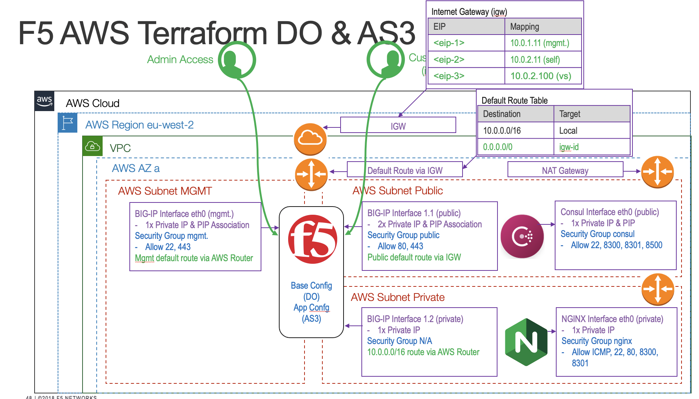

# auto201

To find the aws image filter, use the aws cli:

aws ec2 describe-images --region eu-west-2 --filters "Name=name,Values=*BIGIP-15.1.1*PAYG-Best*25Mbps*" | grep '\"Name\"\|\"ImageId\"'

aws ec2 describe-images --region eu-west-2 --filters "Name=name,Values=*BIGIP-15.1.1*PAYG-Best*25Mbps*" | grep '\"Name\"\|\"ImageId\"\|"OwnerId"'

OwnerId added as we use in data lookup for ami.

Terraform uses credentials in ~/aws/credentials

- tfswitch -- Switch into a particular version of terraform.
- terraform init  -- initialise terraform
- terraform plan  -- plan changes
- terraform apply -- apply changes
- terraform fmt   -- formats the tf files
- terraform console -- Console ouptut

- AZ:

eu-west-2a

- Subnets:

mgmt: 10.0.1.0/24
public: 10.0.2.0/24
private: 10.0.3.0/24

- Password:

id in terraform.tfstate file

- Debug:

Turn on:  export TF_LOG=DEBUG

Turn off: export TF_LOG=""

- Variables:

variable "f5_ami_search_name" {
  description = "filter used to find AMI for deployment"
  default     = "F5*BIGIP-15.1.1*Best*25Mbps*"
}

var.f5_ami_search_name

tags = {
    Name  = "${var.prefix}-f5"
    Env   = "aws"
    UK-SE = var.uk_se_name
  }
  
-  Interpolation required when appending string to variable.

- main.tf -- Generate random password and fetch my ip
- vpc.tf -- Create Simple VPC
- sg.tf -- Create Security Groups
- eni.tf -- Create Elastic Network Interfaces
- eip.tf -- Create Elastic IP
- ec2.tf -- Lookup AMI and create instance
- ssh.tf -- Creates Key Pair
- nginx.tf -- Creates nginx
- consul.tf -- Creates consul mesh
- outputs.tf -- Output variables
- vars.tf -- Prefix Variables

- This is the fixed version of the template_file configuration block:

data "template_file" "f5_init" {
  template = file("./templates/user_data_json.tpl")
  vars = {
    hostname    = "mybigip.f5.com",
    admin_pass  = random_string.password.result,
    external_ip = "${aws_eip.public-self.private_ip}/24",
    internal_ip = "${aws_network_interface.private.private_ip}/24",
    internal_gw = cidrhost(module.vpc.private_subnets_cidr_blocks[0], 1),
    vs1_ip      = aws_eip.public-vs1.private_ip,
    consul_uri      = "http://${aws_instance.consul.private_ip}:8500/v1/catalog/service/nginx",
    do_declaration  = data.template_file.do.rendered,
    as3_declaration = data.template_file.as3.rendered
  }
}

We didn't get to walk through all of the resulting configuration, so highlights are:

- open the Consul URI and check that the NGINX instances are registered.
- check in AWS that the EC2 > Autoscale Group is configured for NGINX.  You can scale up/down.
- note that AS3 does not include pool members.  They are populated by AS3 pulling the NGINX IPs from Consul.
- note that as you scale up/down NIGINX instances, AS3 updates the pool members automatically.
- Terraform apply from scratch should take 7/8 mins. 
- Now you have an easy to use F5 lab.